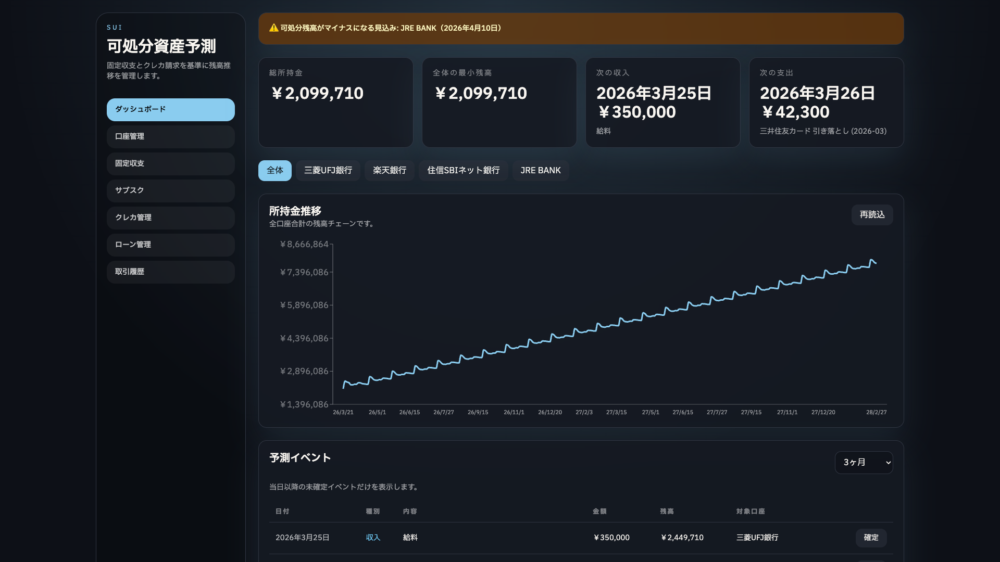
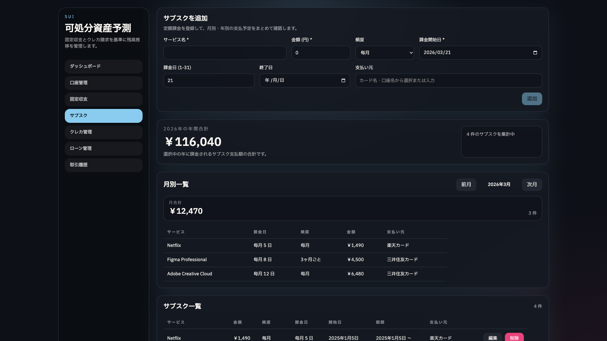
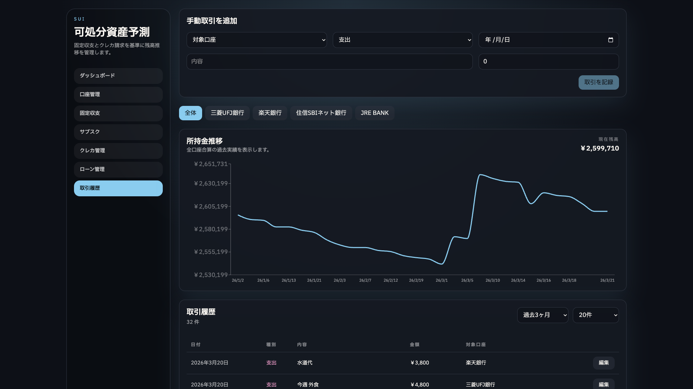

# sui — 可処分資産予測

個人の資産を管理し、将来の残高を予測するための Web アプリケーションです。

銀行口座の残高、固定収支、クレジットカードの引き落とし、ローンの返済スケジュールなどを登録し、今後数か月の可処分残高推移をチャートで可視化できます。



<details>
<summary>その他のスクリーンショット</summary>

| サブスク管理 | 取引履歴 |
|:-:|:-:|
|  |  |

</details>

## 主な機能

| 機能 | 概要 |
|------|------|
| **ダッシュボード** | オフセット適用の有無を切り替えながら、合計残高・最小残高・直近の収支と可処分残高推移を確認 |
| **口座管理** | 複数の銀行口座を登録し、実残高とオフセットを管理 |
| **固定収支** | 給与・家賃など毎月の定期的な収入・支出を登録 |
| **サブスク管理** | サブスクリプションの支払いを一元管理し、月別・年間の合計額を確認（残高予測には直接統合しない） |
| **クレジットカード** | カードごとに想定額と実績額を管理し、引き落とし予測に反映 |
| **ローン** | 返済総額・回数・開始日から月々の返済予測を自動計算 |
| **取引履歴** | 手動での入出金・口座間振替を記録・編集し、オフセット適用の有無を切り替えながら過去の残高推移を確認 |
| **予測の手動確定** | 取引予定日を過ぎた予測イベントを、実際の金額と口座を確認した上で実取引として確定 |

## 設計前提

- **認証と信頼境界**: 本番利用では、アプリの前段に置くリバースプロキシの mTLS で利用者認証を担保する前提です。アプリ内にログイン機能やセッション認証を実装していないのは意図的な設計判断です。API をこの信頼境界の外へ直接公開しないでください。将来、SSE / Streamable HTTP などのサーバーサイド MCP をリモート公開する場合は、MCP クライアントからの inbound 認証（Bearer token や OAuth など）が別途必要です。
- **残高予測とサブスクの境界**: 残高予測は固定収支、クレジットカード請求、ローン返済から生成します。サブスクの大半はクレジットカード払いで、カード請求額の仮定値または実績額に既に含まれるため、サブスクを予測イベントへ直接統合すると二重計上になります。このアプリの本質は、クレジットカード明細ではなく「クレジットカード以外の口座残高」を管理することです。カード払いではない定額支払いを予測に入れる場合は、現時点では固定収支として登録してください。
- **予測確定は手動**: 予定額と実際の引き落とし額が一致するとは限らないため、予定日を過ぎた予測イベントも自動確定しません。UI または MCP 経由で、金額と対象口座を人間が確認してから `POST /api/dashboard/confirm` で実取引化します。
- **残高の直接編集**: 既存 API では口座残高の更新が可能ですが、残高の直接編集は履歴を遡及的にずらすため、将来的には塞ぐ方向です。一方で、使途不明金のようなズレを吸収する仕組みは必要であり、`adjustment` 取引または照合（reconcile）フローとして設計課題にしています（現時点では未実装）。

## 技術スタック

| レイヤー | 技術 |
|----------|------|
| フロントエンド | React 18, React Router v6, Recharts, Tailwind CSS |
| バックエンド | Hono |
| データベース | PostgreSQL 18 |
| MCP サーバー | @modelcontextprotocol/sdk |
| DB パッケージ | Prisma ORM（スキーマ・マイグレーション） |
| 共有パッケージ | TypeScript 型定義・定数 |
| ビルド | Vite (フロントエンド), tsup (バックエンド・MCP) |
| テスト | Vitest (単体・結合), Playwright (E2E) |
| インフラ | Docker, Docker Compose |
| CI | GitHub Actions |
| 言語 | TypeScript (全パッケージ) |

## プロジェクト構成

```
sui/
├── packages/
│   ├── frontend/     # React SPA
│   ├── backend/      # Hono API サーバー
│   ├── db/           # Prisma スキーマ・マイグレーション
│   ├── mcp/          # MCP サーバー（LLM 連携）
│   └── shared/       # 共有型定義・定数
├── e2e/              # Playwright E2E テスト
├── scripts/          # シードスクリプト
├── compose.yaml      # 本番用 Docker Compose
├── compose_db.yaml   # テスト用 DB
├── Dockerfile        # マルチステージビルド
├── Makefile          # 開発タスクランナー
└── playwright.config.ts
```

## セットアップ

### 前提条件

- **Node.js** 24 以上
- **pnpm** 10 以上
- **Docker** および **Docker Compose** (データベース用)

### インストール

```bash
pnpm install
```

### データベースの起動

テスト・開発用の PostgreSQL をコンテナで起動します。

```bash
docker compose -f compose_db.yaml up -d --wait
```

### データベースのマイグレーション

```bash
pnpm --filter @sui/db db:generate
pnpm --filter @sui/db prisma:migrate
```

### 開発サーバーの起動

フロントエンドとバックエンドを同時に起動します。

```bash
pnpm dev
```

- フロントエンド: http://localhost:5173
- バックエンド API: http://localhost:3000

フロントエンドの開発サーバーは `/api` へのリクエストをバックエンドにプロキシします。

### シードデータの投入

アプリケーション起動後、サンプルデータを段階的に投入できます。
口座、固定収支、サブスク、クレジットカード、ローン、取引履歴をまとめて投入します。

```bash
bash scripts/seed.sh
```

```bash
bash scripts/seed.sh phase2
bash scripts/seed.sh phase3
bash scripts/seed.sh all
```

- `phase1` (デフォルト): 一切の不足が発生しない基本データ
  サブスク管理ページ用のサンプルデータも含みます。
- `phase2`: オフセット不足のみが発生する追加データ
- `phase3`: 実残高マイナスが発生する追加データ
- `all`: `phase1 -> phase2 -> phase3` を順に投入

`phase2` と `phase3` は追加投入用です。段階確認するなら `phase1` の後に順番に流してください。

## 環境変数

| 変数名 | 説明 | デフォルト |
|--------|------|------------|
| `DATABASE_URL` | PostgreSQL 接続文字列 | (必須) |
| `PORT` | バックエンドのポート番号 | `3000` |
| `STATIC_DIR` | フロントエンドの静的ファイルパス | `../frontend/dist` |
| `VITE_API_BASE` | フロントエンドからの API ベース URL | `http://localhost:3000` |
| `SUI_API_URL` | MCP サーバーからの API ベース URL | `http://localhost:3000` |
| `SUI_MCP_TRANSPORT` | MCP サーバーの transport (`stdio`, `sse`, `streamable-http`) | `stdio` |
| `SUI_MCP_ADDRESS` | MCP HTTP transport の待受アドレス | `localhost:8000` |
| `SUI_MCP_BASE_PATH` | MCP HTTP transport のベースパス | （未設定） |
| `SUI_MCP_ENDPOINT_PATH` | Streamable HTTP の MCP エンドポイント | `/mcp` |

## API エンドポイント

すべてのエンドポイントは `/api` プレフィックス付きです。

`Account` には実残高 `balance` に加えて、可処分残高計算用の `balanceOffset` があります。ダッシュボードの `totalBalance` や口座別 `currentBalance`、残高推移グラフはデフォルトで `balance - balanceOffset` を基準に計算されます。`applyOffset=false` を指定すると、オフセットを適用しない実残高ベースの表示に切り替えられます。

| メソッド | パス | 説明 |
|----------|------|------|
| GET | `/api/dashboard?applyOffset=true\|false` | ダッシュボードデータ（可処分残高予測・イベント一覧）。`applyOffset=false` で実残高ベースに切替 |
| GET | `/api/dashboard/events?months=1-24&applyOffset=true\|false` | 指定月数ぶんの予測イベントのみを取得 |
| POST | `/api/dashboard/confirm` | 実績確認済みの予測イベントを手動で実取引として確定 |
| GET | `/api/accounts` | 口座一覧（実残高・オフセットを含む） |
| POST | `/api/accounts` | 口座作成 |
| PUT | `/api/accounts/:id` | 口座更新（現行 API では残高更新を含む。将来的には調整取引・照合フローへ移行予定） |
| DELETE | `/api/accounts/:id` | 口座削除（論理削除） |
| GET | `/api/transactions` | 取引一覧（ページネーション・フィルタ対応） |
| GET | `/api/transactions/balance-history?accountId=:id&startDate=YYYY-MM-DD&endDate=YYYY-MM-DD&applyOffset=true\|false` | 取引履歴から逆算した過去の残高推移を取得 |
| POST | `/api/transactions` | 取引作成（入金・出金・振替） |
| PUT | `/api/transactions/:id` | 取引更新（残高の巻き戻し・再適用を含む） |
| GET | `/api/recurring-items` | 固定収支一覧 |
| POST | `/api/recurring-items` | 固定収支作成 |
| PUT | `/api/recurring-items/:id` | 固定収支更新 |
| DELETE | `/api/recurring-items/:id` | 固定収支削除 |
| GET | `/api/subscriptions` | サブスク台帳の一覧（残高予測には直接反映しない） |
| POST | `/api/subscriptions` | サブスク台帳の作成 |
| PUT | `/api/subscriptions/:id` | サブスク台帳の更新 |
| DELETE | `/api/subscriptions/:id` | サブスク削除 |
| GET | `/api/credit-cards` | クレジットカード一覧 |
| POST | `/api/credit-cards` | クレジットカード作成 |
| PUT | `/api/credit-cards/:id` | クレジットカード更新 |
| DELETE | `/api/credit-cards/:id` | クレジットカード削除 |
| GET | `/api/billings?month=YYYY-MM` | 指定月のクレジットカード請求データ |
| PUT | `/api/billings/:yearMonth` | 請求データ更新 |
| GET | `/api/loans` | ローン一覧 |
| POST | `/api/loans` | ローン作成 |
| PUT | `/api/loans/:id` | ローン更新 |
| DELETE | `/api/loans/:id` | ローン削除 |

## テスト

```bash
# 単体テスト
make test-unit

# 型チェック
make typecheck

# 結合テスト
make test-integration

# E2E テスト
make test-e2e
```

`make test-integration` と `make test-e2e` はテスト用 DB の起動・マイグレーション・停止を自動で行います。

## リリース

GitHub Actions の `Release` workflow を手動実行し、`version` に `1.8.0` や `1.8.0-rc.1` のような SemVer を入力します。タグは既存リリースに合わせて `v` prefix なしで作成されます。

workflow は package version の更新と同期、`make lint` / `make typecheck` / `make test-unit` / `make build` / `make test-integration` / `make test-e2e` の検証、release commit、tag、GitHub Release 作成までを実行します。その後、Docker image と MCP package の publish workflow を同じ tag で実行し、完了まで待ちます。

ローカルで version だけ確認・同期したい場合は以下を使います。

```bash
make version-set VERSION=1.8.0
make version-check
```

## MCP サーバー

[MCP (Model Context Protocol)](https://modelcontextprotocol.io/) サーバーにより、LLM（Claude、Copilot 等）から家計データの参照・操作が可能です。npm パッケージ [`@soli0222/sui-mcp`](https://www.npmjs.com/package/@soli0222/sui-mcp) として公開しています。

### クライアント設定例

Claude Desktop (`claude_desktop_config.json`) / VS Code (`.vscode/mcp.json`):

```json
{
  "mcpServers": {
    "sui": {
      "command": "npx",
      "args": ["@soli0222/sui-mcp"],
      "env": {
        "SUI_API_URL": "http://localhost:3000"
      }
    }
  }
}
```

### HTTP / SSE モード

コンテナや常駐プロセスとして MCP サーバーを公開する場合は、 transport を指定できます。

```bash
# Legacy SSE: http://localhost:8000/sse
npx @soli0222/sui-mcp -t sse --address :8000

# Streamable HTTP: http://localhost:8000/mcp
npx @soli0222/sui-mcp -t streamable-http --address :8000
```

HTTP transport では `/healthz` をヘルスチェックに利用できます。

HTTP / SSE transport は MCP クライアントからの inbound 認証をアプリ側では行いません。リモート公開する場合は、リバースプロキシや MCP サーバー側で Bearer token / OAuth などの認証を追加してください。API への outbound 接続を mTLS 化するだけでは、MCP エンドポイント自体の利用者認証にはなりません。

MCP サーバーのみを Docker で起動する場合:

```bash
docker compose -f compose.mcp.yaml up -d --build
```


## 本番ビルド

### ローカルビルド

```bash
pnpm build
```

### Docker

```bash
# イメージのビルドと起動
docker compose up -d --build
```

アプリケーションが http://localhost:3000 で起動します。
コンテナ内で Prisma のマイグレーションが自動実行されます。

## Makefile タスク

```bash
make help          # 利用可能なタスク一覧
make typecheck     # 型チェック
make test-unit     # 単体テスト
make test-integration  # 結合テスト
make test-e2e      # E2E テスト
make build         # プロダクションビルド
make test-db-up    # テスト用 DB 起動
make test-db-down  # テスト用 DB 停止
```

## ライセンス

[MIT](LICENSE)
