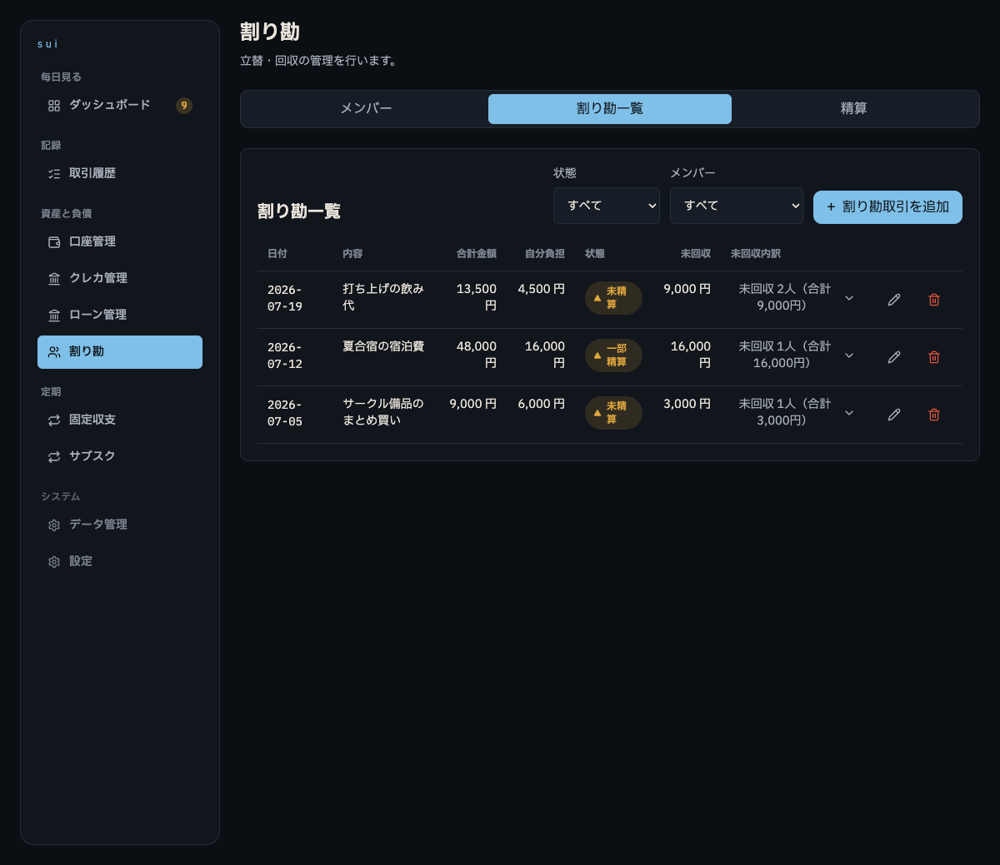

# sui — 可処分資産予測

個人の資産を管理し、将来の残高を予測するための Web アプリケーションです。

銀行口座の残高、固定収支、クレジットカードの引き落とし、ローンの返済スケジュールを登録すると、今後数か月の可処分残高推移をチャートで確認できます。


<details>
<summary>その他のスクリーンショット</summary>

| サブスク管理 | 取引履歴 |
|:-:|:-:|
|  |  |

| 割り勘 |
|:-:|
|  |

</details>

## 主な機能

| 機能 | 概要 |
|------|------|
| **ダッシュボード** | 合計残高、期間内最小残高、次の収支と可処分残高推移を確認。オフセット適用の有無を切り替えられる |
| **予測の手動確定** | 予定日を過ぎた予測イベントを、実際の金額と口座を確認したうえで実取引として確定 |
| **口座管理** | 複数口座の実残高、オフセット、最終照合日時を管理。照合で差分を調整取引として記録 |
| **固定収支** | 給与、家賃など毎月または毎週の定期的な収入と支出を登録 |
| **クレジットカード** | カードごとに想定額と実績額を管理し、引き落とし予測に反映 |
| **ローン** | 返済総額と回数から月々の返済額を計算。繰上返済を織り込んで残りを組み直す |
| **サブスク管理** | 定額課金を一元管理し、月別と年間の合計額を確認（残高予測には直接統合しない） |
| **取引履歴** | 入出金、口座間振替、残高調整を記録し、過去の残高推移を逆算して表示 |
| **割り勘** | 立替をメンバーごとの負担額に分割し、回収を精算として記録（残高予測には含めない） |
| **複数通貨** | JPY、USD、EUR の口座とサブスクに対応。合計は JPY 換算 |
| **データ管理** | 全データの JSON エクスポートと全置換インポート |
| **MCP** | backend 内蔵の `/mcp` から、AI クライアントで資産データを参照、更新 |

## ドキュメント

設計の理由と規則の詳細は [`docs/`](docs/index.md) にまとめています（Open Knowledge Format のナレッジバンドル）。

- [ガイド](docs/guides/index.md)：初期セットアップと日々の使い方
- [ドメイン規則](docs/concepts/index.md)：可処分残高、予測イベント、カード請求の安全弁、割り勘、営業日シフトなど
- [アーキテクチャ](docs/architecture/index.md)：パッケージ構成、予測パイプライン、認証、MCP、可観測性
- [運用](docs/operations/index.md)：開発環境、環境変数、リリース手順
- [API エンドポイント一覧](docs/references/api-endpoints.md)

## 設計前提

- **口座残高を管理する**。クレジットカード明細の中身ではありません。カード払いの支出は請求額としてまとめて扱います。
- **二重計上を避ける**。サブスクも割り勘の債権も、既に別の形で残高へ反映されているものは予測に足しません。カード払いでない定額支払いを予測に入れる場合は、固定収支として登録します。
- **確定は人間が行う**。予定額と実際の引き落とし額は一致しません。予定日を過ぎても自動では取引にしません。
- **記録を書き換えない**。残高のずれは `adjustment` 取引として残し、過去の履歴を遡って直しません。
- **認証情報を持たない**。アプリ内に ID とパスワードは持たず、利用者の認証は外部 IdP の OIDC に委ねます。API は UI で発行する API トークン、MCP は API トークンまたは Auth0 access token で認証します。

それぞれの理由は [ドキュメント](docs/index.md) に書いています。

## 技術スタック

| レイヤー | 技術 |
|----------|------|
| フロントエンド | React 18, React Router v6, Recharts, Tailwind CSS |
| バックエンド | Hono |
| データベース | PostgreSQL 18 |
| MCP | backend に内包（`/mcp`） |
| DB パッケージ | Prisma ORM（スキーマとマイグレーション） |
| 共有パッケージ | TypeScript 型定義、定数、日付とスケジュールの計算 |
| ビルド | Vite（フロントエンド）, tsup（バックエンド） |
| テスト | Vitest（単体、結合）, Playwright（E2E） |
| 可観測性 | OpenTelemetry, pino |
| インフラ | Docker, Docker Compose |
| CI | GitHub Actions |

## プロジェクト構成

```
sui/
├── packages/
│   ├── frontend/     # React SPA
│   ├── backend/      # Hono API サーバー（MCP も内包）
│   ├── db/           # Prisma スキーマ、マイグレーション
│   └── shared/       # 共有型定義、定数、日付計算
├── docs/             # ナレッジバンドル（OKF）
├── e2e/              # Playwright E2E テスト
├── scripts/          # シードスクリプト
├── compose.yaml      # ローカル開発用 Docker Compose
├── compose_db.yaml   # テスト用 DB
├── Dockerfile        # マルチステージビルド
└── Makefile          # 開発タスクランナー
```

## セットアップ

### 前提条件

- **Node.js** 24 以上
- **pnpm** 10 以上
- **Docker** および **Docker Compose**

### 起動

```bash
pnpm install
docker compose -f compose_db.yaml up -d --wait
pnpm --filter @sui/db db:generate
pnpm --filter @sui/db prisma:migrate
pnpm dev
```

- フロントエンド: http://localhost:5173
- バックエンド API: http://localhost:3000

フロントエンドの開発サーバーは `/api` へのリクエストをバックエンドにプロキシします。

### シードデータ

```bash
bash scripts/seed.sh          # phase1: 不足の起きない基本データ
bash scripts/seed.sh phase2   # オフセット不足が起きる追加データ
bash scripts/seed.sh phase3   # 実残高マイナスが起きる追加データ
bash scripts/seed.sh all      # phase1 から順に全部
```

`phase2` と `phase3` は追加投入用です。
段階を確認するなら `phase1` の後に順に流してください。

## 環境変数

必須は `DATABASE_URL` だけです。

| 変数名 | 説明 | 既定 |
|--------|------|------|
| `DATABASE_URL` | PostgreSQL 接続文字列 | 必須 |
| `PORT` | バックエンドのポート | `3000` |
| `SUI_AUTH_MODE` | 認証モード（`enabled` / `disabled`） | `enabled` |
| `SUI_OIDC_ISSUER` ほか `SUI_OIDC_*` | OIDC の issuer、クライアント、許可する利用者 | 未設定 |
| `SUI_MCP_OAUTH_RESOURCE_URL` | ChatGPT などから OAuth で接続する公開 `/mcp` URL | 未設定 |
| `OTEL_EXPORTER_OTLP_ENDPOINT` | トレースの送信先。`http://collector:4318` のようにパスなしのベース URL で書く。未設定ならトレース計装を起動しない | 未設定 |

全項目は [設定と環境変数](docs/operations/configuration.md) にあります。

## テスト

テストは Makefile 経由で実行します。

```bash
make lint              # Lint
make typecheck         # 型チェック
make test-unit         # 単体テスト
make test-integration  # 結合テスト
make test-e2e          # E2E テスト
make build             # プロダクションビルド
make help              # タスク一覧
```

`make test-integration` と `make test-e2e` は、テスト用 DB の起動、マイグレーション、停止を自動で行います。

## MCP サーバー

[MCP (Model Context Protocol)](https://modelcontextprotocol.io/) エンドポイント `/mcp` を backend に内包しています。
UI の「設定」で API トークンを発行し、クライアントに URL と Bearer トークンを設定してください。

```json
{
  "mcpServers": {
    "sui": {
      "type": "streamable-http",
      "url": "https://sui.example.com/mcp",
      "headers": {
        "Authorization": "Bearer sui_tok_..."
      }
    }
  }
}
```

ChatGPT のカスタム MCP アプリから URL だけで接続する場合は、Auth0 に MCP resource とクライアントを登録したうえで、次を設定します。

```dotenv
SUI_AUTH_MODE=enabled
SUI_OIDC_ISSUER=https://auth.example.com
SUI_OIDC_ALLOWED_SUBJECTS=auth0|既存ユーザーのsubject
SUI_MCP_OAUTH_RESOURCE_URL=https://sui.example.com/mcp
```

`SUI_OIDC_ISSUER` は UI と同じ Auth0 カスタムドメインを指定します。
OAuth では verified email だけの許可は使わず、既存 UI ユーザーの `sub` を `SUI_OIDC_ALLOWED_SUBJECTS` に含める必要があります。
有効化すると `/.well-known/oauth-protected-resource/mcp` が Auth0 を案内し、`read:sui` は参照、`write:sui` は更新を許可します。
OAuth access token は sui に保存しません。
Auth0 側で同意や refresh token を取り消した後も、発行済み JWT は期限まで有効な場合があります。即時停止する場合は subject を許可リストから除外してください。

接続手順は次のとおりです。

1. Auth0 で MCP resource の audience を公開 `/mcp` URL にし、`read:sui` と `write:sui`、ChatGPT 用 CIMD client grant を設定します。
2. 既存 UI ユーザーの `sub` を `SUI_OIDC_ALLOWED_SUBJECTS` に追加し、上記の環境変数を設定して sui をデプロイします。
3. `GET /.well-known/oauth-protected-resource/mcp` が同じ resource と Auth0 issuer を返し、無認証の `/mcp` がその metadata URL を `WWW-Authenticate` で案内することを確認します。
4. ChatGPT の開発者モードでカスタム MCP アプリを作り、公開 `/mcp` URL だけを登録します。API トークン、Client ID、Client Secret は入力しません。
5. 表示された Auth0 画面で既存ユーザーのパスキーを使ってログインし、scope に同意した後、ツール一覧と参照操作を確認します。
6. access token 更新後も同じ接続で操作できることを確認します。refresh token が失効した場合は再ログインします。

`/mcp` は Bearer トークンだけを受け付け、セッション Cookie は受け付けません。
stdio と独立 MCP サーバーは廃止しました。
詳細は [MCP エンドポイント](docs/architecture/mcp-endpoint.md) を参照してください。

## ローカルビルド

```bash
pnpm build                    # ローカルビルド
docker compose up -d --build  # Docker で起動
```

http://localhost:3000 で起動します。
Prisma のマイグレーションはコンテナ内で自動実行されます。

## リリース

GitHub Actions の `Release` workflow を手動実行し、`version` に `1.8.0` のような SemVer を入力します。
手順の詳細は [リリース](docs/operations/release.md) にあります。

## ライセンス

[MIT](LICENSE)
